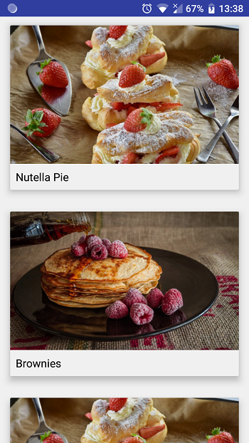
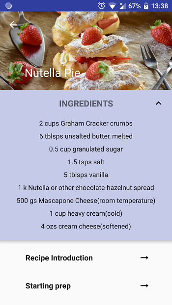
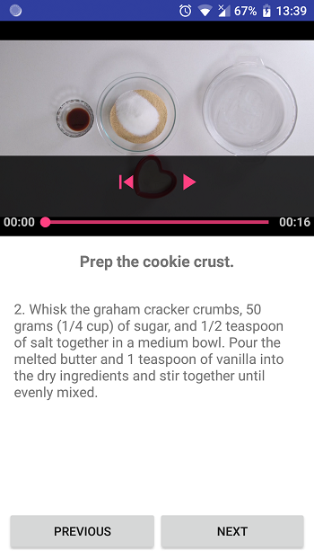

# Baking App Project

### Part of the Udacity Developer Nanodegree Program

## Project Overview
You will productionize an app, taking it from a functional state to a production-ready state. This will involve finding and handling error cases, adding accessibility features, allowing for localization, adding a widget, and adding a library.

### In this project you will:

* Use MediaPlayer/Exoplayer to display videos.
* Handle error cases in Android.
* Add a widget to your app experience.
* Leverage a third-party library in your app.
* Use Fragments to create a responsive design that works on phones and tablets.

---

## Frameworks and Libraries used
* Android Architecture Components (Room, Livedata, ViewModel) with Android Databinding
* Retrofit
* Dagger 2
* Picasso
* ExoPlayer
* Espresso and Mockito

## Screenshots
  
